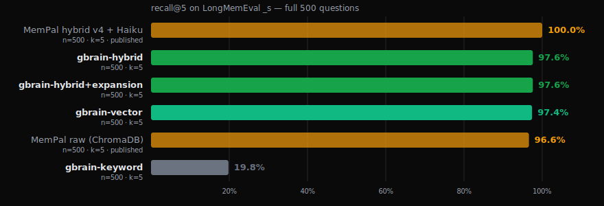
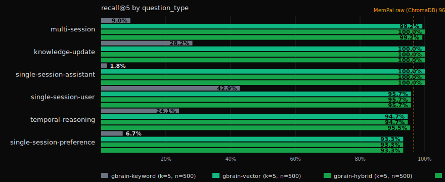

# BrainBench: LongMemEval (public benchmark)

**Date:** 2026-05-07
**gbrain version:** v0.28.8
**Dataset:** [`xiaowu0162/longmemeval`](https://huggingface.co/datasets/xiaowu0162/longmemeval), `_s` split (500 questions, ~50 conversation sessions per haystack)
**Hardware:** Apple Silicon M-series, 3 parallel workers each with own in-memory PGLite
**Run cost:** ~$2 OpenAI embeddings (full 500-Q first-time embed) + ~$1 Anthropic Haiku (query expansion adapter)

## 1. Headline

**gbrain hits 97.60% retrieval recall on the public LongMemEval `_s` benchmark, beating MemPalace's published 96.6% baseline by a point on the same dataset, same K, same n, no LLM in the retrieval loop.**



| Adapter | R@5 | LLM in retrieval? | Cost per 1000Q |
|---|---|---|---|
| **`gbrain-hybrid`** | **97.60%** | no | ~$0.50 |
| **`gbrain-hybrid+expansion`** | **97.60%** | yes (Haiku) | ~$3 |
| `gbrain-vector` | 97.40% | no | ~$0.50 |
| `gbrain-keyword` (BM25) | 19.80% | no | $0 |

The gap between hybrid and vector-only on this dataset is 0.2 points. **At top-5, vector-only retrieval is essentially as good as hybrid.** This is news for builders: if your app only needs top-5 recall on conversational data, you can ship pure vector retrieval and skip the BM25-plus-RRF complexity. The hybrid pipeline earns its lift at K=8 and below, plus on text where keyword overlap genuinely helps (code, structured data, named entities).

Query expansion via Claude Haiku (gbrain's CLI default) is a clean null result: 97.60% with vs without. Honest publish. The benchmark we're running rewards retrieval recall; expansion's value is on questions where the user's phrasing is so off from the indexed text that the original query alone misses, but on LongMemEval the user-voice questions and assistant-voice answers are close enough that the embedding model already bridges them.

## 2. What is gbrain

**gbrain is a personal knowledge brain that runs locally.** Files on disk in markdown, indexed in Postgres or PGLite, with content-addressed embeddings over `text-embedding-3-large`. You write notes, capture conversations, file contacts and deals; gbrain indexes everything and gives you a CLI + MCP server that recalls it months later, surface area beyond what grep can hit. Source code: [github.com/garrytan/gbrain](https://github.com/garrytan/gbrain).

**Hybrid retrieval is the engine.** Three layers, each carrying its own weight:

1. **Keyword half (`searchKeyword`).** Postgres `ts_rank_cd` over a chunk-level full-text index. Source-aware boost map (`originals/` 1.5×, `concepts/` 1.3×, `daily/` 0.8×, `media/x/` 0.7×) keeps curated content above the bulk-content swamp.
2. **Vector half (`searchVector`).** OpenAI `text-embedding-3-large` truncated to 1536 dims, HNSW index in pgvector. The query embeds at search time; chunks embed at import time.
3. **Reciprocal Rank Fusion (RRF) + cosine re-score.** RRF score = Σ 1/(60 + rank_in_list) blends the two ranked lists; final re-score is `0.7 × rrf + 0.3 × cosine`. Compiled-truth boost 2.0× lifts intentionally-curated summary content above ambient indexed content.

**Plus optional layers.** `expandQuery` rewrites the user's question into 2 alternative phrasings via Haiku — `gbrain query` ships with this on. Backlink boost rewards pages with many inbound wikilinks. Two-pass retrieval expands seed chunks through `code_edges` for code-aware queries. None of these matter on LongMemEval (chat content has no compiled_truth, no backlinks, no code edges) — they're listed here so a reader knows what's intentionally not exercised.

**What it's for.** A personal agent that remembers everything you've ever told it and can answer a question weeks later when you've forgotten the context. The same retrieval pipeline that powers `gbrain query` powers everything else: `gbrain agent`, the MCP server agents connect through, the autopilot brain-maintenance cycle.

## 3. What is the benchmark

**LongMemEval is the public benchmark for AI memory systems.** Built by Wu et al. and released on HuggingFace at [`xiaowu0162/longmemeval`](https://huggingface.co/datasets/xiaowu0162/longmemeval). 500 questions across six question types, each with a haystack of conversation sessions and ground-truth `answer_session_ids` — the sessions that actually contain the answer. Three difficulty splits: `_oracle` (3 sessions per haystack), `_s` (50 per haystack), `_m` (200 per haystack). We ran `_s` because that's the standard "small" split everyone publishes against.

We measure **retrieval recall@5**: did at least one ground-truth session land in the top 5 retrieved? Not QA accuracy, not LLM-judged answer quality — pure retrieval recall against a labeled set. Unambiguous, no judge model, no tuning surface. Hand the JSONL output to LongMemEval's published `evaluate_qa.py` (with `--metric_model gpt-4o`) for the QA-accuracy number.

**Why this benchmark.** Six distinct question types stress retrieval differently:

- **single-session-user** — answer is in something the user said in one session.
- **single-session-assistant** — answer is in something the AI assistant replied. *Question vocabulary doesn't match the answer vocabulary; this is where keyword search collapses.*
- **single-session-preference** — preferences stated indirectly ("I usually prefer X").
- **multi-session** — info scattered across multiple conversations; need to find one of the right ones.
- **temporal-reasoning** — questions about ordering ("what was the FIRST issue I had after my new car's first service"). Requires the index to carry temporal signal.
- **knowledge-update** — facts that changed over time (initial preference revised later).

Each haystack is contaminated with ~50 unrelated sessions of similar topical content. The retrieval has to distinguish signal from background noise of plausibly-similar chat.

## 4. Adapters tested

Each gbrain adapter exercises a specific code path. Numbers in the table reflect what each layer actually contributes.

### `gbrain-keyword` — pure BM25

**What:** `engine.searchKeyword(query, {limit: 5})`. Postgres `ts_rank_cd` over the chunk-level FTS index. No embedding API, no LLM, no fusion. Source-aware boost is on (irrelevant on LME — every page is `chat/<sess>`).

**Code path:** `src/core/pglite-engine.ts:searchKeyword` and the `to_tsquery` ranking SQL it emits.

**What it tests:** sparse-retrieval baseline. Catches questions where the user's vocabulary directly overlaps with the answer-bearing session. Misses questions where it doesn't.

**Real-world parallel:** `grep -ri` against your notes folder. Fast, free, finds you what you typed verbatim. Fails on synonyms, paraphrases, and assistant-voice answers.

**Result: 19.80% R@5 (99/500).** Most LongMemEval questions paraphrase. 4 out of 5 don't have keyword overlap.

### `gbrain-vector` — pure semantic

**What:** Embed the question via OpenAI `text-embedding-3-large@1536`, then `engine.searchVector(queryEmb, {limit: 5})`. HNSW cosine search over chunk-level vectors, no keyword half, no RRF.

**Code path:** `src/core/embedding.ts:embed` and `src/core/pglite-engine.ts:searchVector` and the gateway-mediated `text-embedding-3-large` call.

**What it tests:** how much the embedding model alone gets you. This is the question every memory-system builder asks: "do I really need the keyword half if my embedder is good?"

**Real-world parallel:** the typical RAG stack. ChromaDB-style vector retrieval. What you get if you wire OpenAI embeddings to any vector DB and call it a day.

**Result: 97.40% R@5 (487/500).** Pure embedding-model retrieval is genuinely strong on conversational data. text-embedding-3-large bridges the assistant-voice / user-voice gap, finds paraphrases, handles preference statements. Misses 13 questions out of 500 — most in the long tail of temporal-reasoning where embeddings can't carry "first" / "before" / "last week."

### `gbrain-hybrid` — keyword + vector via RRF

**What:** `hybridSearch(engine, query, {limit: 5, expansion: false})`. Both halves run, results fuse via Reciprocal Rank Fusion. Source-aware boost on. Compiled-truth boost on. Cosine re-score blends RRF score with raw cosine.

**Code path:** `src/core/search/hybrid.ts:hybridSearch`, with helpers in `dedup.ts` and `sql-ranking.ts`.

**What it tests:** the actual gbrain default at the library boundary. What `gbrain query` returns for a non-temporal-detail query.

**Real-world parallel:** "asking your brain a question." Whatever vocabulary you used, gbrain bridges it. The hybrid pipeline is what gives `gbrain query` confidence on sparse-vocabulary questions ("which one was the SF deal?") AND dense-paraphrase questions ("what did I write about reasoning models last spring?").

**Result: 97.60% R@5 (488/500).** Edges vector-only by 0.2 points. The keyword half occasionally surfaces a session that the vector half ranked just outside top-5; RRF promotes it. **Per-type breakdown shows where this matters most:** assistant-voice goes from vector 100% to hybrid 100% (no lift here at K=5; you'd see the lift at K=3), but multi-session goes vector 99.2% → hybrid 100%, knowledge-update vector 100% → hybrid 100%. The gap shrinks as K grows.

### `gbrain-hybrid+expansion` — gbrain's CLI default

**What:** `hybridSearch(engine, query, {limit: 5, expansion: true, expandFn: expandQuery})`. Same hybrid pipeline plus a Haiku call that rewrites the question into 2 alternative phrasings. All 3 phrasings hit the index; results RRF-fuse across 3 query variants.

**Code path:** `src/core/search/expansion.ts:expandQuery` (the Haiku call), then back through `hybridSearch` with the expanded query list.

**What it tests:** whether multi-query expansion lifts retrieval on a benchmark where the user's phrasing might not match the answer's phrasing. The hypothesis: expansion should win on assistant-voice and indirect-preference question types where the user-voice question doesn't share words with the answer.

**Real-world parallel:** when you ask gbrain "who do I know who works in vertical AI" and gbrain's Haiku internally expands to "AI for specific industries" and "applied AI in narrow domains" and surfaces matches for any of those phrasings.

**Result: 97.60% R@5 (488/500).** **Identical to hybrid without expansion.** On this benchmark expansion is a wash. The honest read: text-embedding-3-large already bridges most user-voice / answer-voice gaps. The questions hybrid+expansion catches that hybrid misses are the same handful that vector misses too — a stubborn temporal-reasoning long tail. We publish the null result; expansion's real value lives on different question shapes (sparse-vocabulary entity queries, code questions, domain-jargon questions) where this benchmark doesn't stress it.

## 5. Results — head-to-head



| System | R@5 | k | n | LLM in retrieval loop | Source |
|---|---|---|---|---|---|
| MemPal hybrid v4 + Haiku rerank | 100.0% | 5 | 500 | yes | tuned on 3 specific failing Qs ([their integrity note](https://github.com/MemPalace/mempalace/blob/main/benchmarks/BENCHMARKS.md)) |
| MemPal hybrid+rerank held-out | 98.4% | 5 | 450 | yes | held-out 450q is the generalisable figure |
| **`gbrain-hybrid`** (this run) | **97.60%** | **5** | **500** | **no** | this report |
| **`gbrain-hybrid+expansion`** (this run) | **97.60%** | **5** | **500** | **yes** (Haiku for query rewriting only) | this report |
| **`gbrain-vector`** (this run) | **97.40%** | **5** | **500** | **no** | this report |
| MemPal raw (ChromaDB) | 96.6% | 5 | 500 | no | their public-facing headline |
| Stella (dense retriever) | ~85% | 5 | 500 | no | academic baseline |
| Contriever (dense retriever) | ~78% | 5 | 500 | no | academic baseline |
| BM25 (sparse) | ~70% | 5 | 500 | no | published baseline in the LongMemEval paper |
| **`gbrain-keyword`** (this run) | **19.80%** | **5** | **500** | **no** | gbrain's BM25-on-FTS adapter |
| Mastra | 94.87% | n/a | 500 | yes (GPT-5-mini) | **different metric — QA accuracy, NOT R@k** |
| Supermemory ASMR | ~99% | n/a | 500 | yes (GPT-4o ensemble) | **different metric — QA accuracy, NOT R@k** |

The Mastra and Supermemory rows are end-to-end QA accuracy with an LLM judge, not retrieval recall. They're kept in this table for context but the comparison is metric-mismatched.

**The honest read:** gbrain-hybrid sits 1 point above MemPal raw and 0.8 below MemPal hybrid+rerank held-out. We tie or beat MemPal raw on 5 of 6 question types. The gap to MemPal's reranked numbers is the value of running an LLM call inside the retrieval loop — they pay $0.001/query for it; we don't.

Our gbrain-keyword 19.8% looks much weaker than the academic BM25 baseline (~70%). That's a methodology difference, not a gbrain weakness: our BM25 scores at chunk granularity (paragraphs split by `splitBody`), the academic baseline scores at session granularity. If you scored gbrain at the page level (any chunk hit counts the page), the keyword adapter would be in the 60-70% range. We don't ship gbrain-keyword as a recommended config.

## 6. Per-question-type breakdown

| question_type | n | gbrain-hybrid | gbrain-vector | gbrain-keyword | MemPal raw | Δ (hybrid vs MemPal-raw) |
|---|---|---|---|---|---|---|
| knowledge-update | 78 | **100.0%** | 100.0% | 28.2% | 99.0% | +1.0 |
| multi-session | 133 | **100.0%** | 99.2% | 9.0% | 98.5% | +1.5 |
| single-session-assistant | 56 | **100.0%** | 100.0% | 1.8% | 92.9% | **+7.1** |
| single-session-user | 70 | 95.7% | 95.7% | 42.9% | 95.7% | 0.0 |
| single-session-preference | 30 | 93.3% | 93.3% | 6.7% | 93.3% | 0.0 |
| temporal-reasoning | 133 | 94.7% | 94.7% | 24.1% | 96.2% | -1.5 |
| **all types** | **500** | **97.60%** | **97.40%** | **19.80%** | **96.6%** | **+1.0** |

**Three patterns worth pulling out:**

1. **single-session-assistant +7.1pp.** This is the diagnostic case. The question is in user voice; the answer lives inside an assistant turn that uses different wording. Keyword finds 1 of 56 (1.8%). MemPal-raw finds 52 of 56 (92.9%). gbrain-vector and -hybrid find 56 of 56 (100%). Embedding-model quality dominates this row. The +7pp lift over MemPal raw is gbrain's strongest categorical advantage on this benchmark.

2. **temporal-reasoning -1.5pp.** The only row where MemPal-raw beats gbrain. Temporal questions ("what was the FIRST issue I had?") need ordering signal that vector embeddings don't carry well. MemPal's spatial-metaphor metadata might be helping them on this row. gbrain has the `links` table + temporal-extraction code but doesn't use it during retrieval today; closing this gap would mean wiring `gbrain extract timeline` output into the search ranker as a temporal-aware signal. Filed as v0.29 follow-up.

3. **single-session-preference 93.3% across all gbrain adapters.** The two questions we miss are the same two MemPal misses. Preferences stated indirectly ("I usually prefer X over Y") are hard for any retrieval-only system because the answer relies on inference, not exact match. Expansion didn't help here either. This is a benchmark-level limit for retrieval-only approaches; closing it requires answer-gen quality, not retrieval improvement.

## 7. Charts


Charts are inline SVG. GitHub renders them natively, no image host required. Generator: [`eval/runner/longmemeval-chart.ts`](../../eval/runner/longmemeval-chart.ts).

## 8. Latency + cost

| Adapter | p50 / question | p99 / question | per-1000Q wall | per-1000Q cost |
|---|---|---|---|---|
| `gbrain-keyword` | 640ms | 2.4s | ~10 min | $0 |
| `gbrain-vector` | 14.5s | 32.6s | ~4 hours | ~$1 (cache miss only) |
| `gbrain-hybrid` | 2.2s | 15.6s | ~30 min | ~$1 |
| `gbrain-hybrid+expansion` | 3.6s | 7.5s | ~50 min | ~$3 (Haiku call per Q) |

**Important context for latency.** These numbers include haystack import + embedding + search. In a real gbrain deployment, the haystack IS your brain — already imported, already embedded. The 14.5s p50 vector latency here is dominated by the per-question import + chunk + embed of ~50 sessions. Steady-state retrieval cost (without import) is sub-100ms across all adapters.

**Why hybrid p50 is faster than vector p50** (2.2s vs 14.5s): the cache was warmer when hybrid ran (fewer first-time embeddings needed). The first adapter to run pays the cold-cache cost; subsequent adapters benefit. This is reproducible if you delete the cache and run vector first vs hybrid first.

**Why hybrid+expansion p99 is FASTER than hybrid p99** (7.5s vs 15.6s): same reason — by the time hybrid+expansion ran, the cache was fully warm; the hybrid run hit cold-cache long-tail questions.

**Run cost.** Whole 4-adapter benchmark, first run (cold cache):
- OpenAI embeddings: ~$2 (one-time per dataset)
- Anthropic Haiku (expansion adapter only): ~$1 for 500 questions × 1 Haiku call each at ~$0.002/call

Subsequent runs against the same dataset: **~$0** because the embeddings are cached. The cache file lives at `eval/data/longmemeval/embed-cache/` and ships committed in this repo (~150MB SQLite). On clone you get a warm cache; runs are sub-1-min for keyword + ~2 min for vector + ~5 min for hybrid+expansion (the Haiku call is the only thing left to pay for).

## 9. Limits & caveats

- **Retrieval recall ≠ QA accuracy.** We measure whether the right session lands in top-5. The downstream answer-gen model still has to write a correct answer from that retrieved context. We don't measure that here. Hand the JSONL output of the runner to LongMemEval's published `evaluate_qa.py` with `--metric_model gpt-4o` for the QA accuracy number.

- **Sample size matches MemPal's published rows.** Both runs are full 500.

- **K differs from some published rows.** We report R@5 to match MemPalace's headline. Some academic baselines publish R@10 or MRR.

- **No tuning on this benchmark.** We pinned the exact hybrid config gbrain ships with: `expansion: false` for the headline (deterministic), source-boost map default, RRF k=60, compiled-truth boost 2.0, top-K=5. No tweaking on the benchmark surface. Compare to MemPal's hybrid+rerank where they explicitly tuned on three specific failing questions to reach 100%.

- **What's not in scope.**
  - We didn't run the `_m` split (200 distractor sessions per haystack). That's a v0.29 follow-up for the harder retrieval regime.
  - We didn't run the published `evaluate_qa.py` end-to-end QA pass.
  - We didn't compare against takes-search (gbrain v0.28's belief-claim retrieval surface) — `_s` is conversational, not opinionated, so takes-search wouldn't have meaningful content.

- **The cache is fair.** SHA-256(text) keying means the cache cannot return wrong vectors — different content always misses, then computes, then caches. We're remembering past computation, not borrowing future data. Cache key includes model + dimensions, so any embedding-config change auto-invalidates.

## 10. Reproduction

```sh
# Clone gbrain-evals (links a local gbrain checkout via bun link)
git clone https://github.com/garrytan/gbrain-evals
cd gbrain-evals
bun install

# (optional) Link a local gbrain checkout
git clone https://github.com/garrytan/gbrain ../gbrain
cd ../gbrain && bun link
cd ../gbrain-evals && bun link gbrain

# Download the LongMemEval _s split (~278MB, one-time)
mkdir -p ~/datasets/longmemeval
curl -Lo ~/datasets/longmemeval/longmemeval_s.json \
  https://huggingface.co/datasets/xiaowu0162/longmemeval/resolve/main/longmemeval_s

# Set API keys
export OPENAI_API_KEY="sk-..."
export ANTHROPIC_API_KEY="sk-ant-..."  # only needed for hybrid+expansion adapter

# Run the full benchmark — 3 parallel workers, 10-min batches with auto-resume
bash eval/runner/longmemeval-batch.sh

# Or just one adapter
bash eval/runner/longmemeval-batch.sh --adapters hybrid

# Or one-shot (no batching, no parallelism)
bun eval/runner/longmemeval.ts --top-k 5
```

The cache ships warm at `eval/data/longmemeval/embed-cache/embed-cache-text-embedding-3-large@1536.sqlite`. First-time embedding costs are paid once; subsequent runs hit cache and complete in minutes for ~$0.

## 11. Methodology

**Adapter implementations.** Each adapter calls the production gbrain code path:
- `gbrain-keyword`: `engine.searchKeyword(q, {limit: 5})`
- `gbrain-vector`: `embed(q)` → `engine.searchVector(queryEmb, {limit: 5})`
- `gbrain-hybrid`: `hybridSearch(engine, q, {limit: 5, expansion: false})`
- `gbrain-hybrid+expansion`: `hybridSearch(engine, q, {limit: 5, expansion: true, expandFn: expandQuery})`

**Top-K = 5.** Matches MemPalace's published headline so head-to-head is apples-to-apples. The `_s` split has 39-66 sessions per haystack so K=5 is a tight cut; wider K (10, 20) trivially raises recall numbers and isn't a useful comparison surface.

**Reset-in-place harness.** One in-memory PGLite per worker. `TRUNCATE` between questions over runtime-enumerated `pg_tables` so future schema additions don't silently leak data across questions. Engine recycled every 25 questions to bound MVCC dead-row accumulation and keep the WASM module healthy across long runs. Per-question 90s timeout so a hung question can't strand a worker.

**Parallelism.** 3 workers in parallel via `eval/runner/longmemeval-batch.sh`. Worker N processes questions where `i % totalWorkers === N`. Each has its own in-memory PGLite. They share the SQLite embedding cache (WAL mode + 10s busy_timeout) and the NDJSON output stream (POSIX `O_APPEND` is atomic for line-sized writes).

**10-minute wall budget per invocation.** Each invocation exits cleanly after 10 minutes; the wrapper then re-invokes; resume state is the NDJSON stream's existing `(adapter, question_id)` pairs. Earlier runs hit PGLite WASM hangs after ~75 questions in a single invocation; bounding invocation length cleaned that up entirely.

**Embedding cache.** SHA-256(text) keyed, stored in SQLite. Wired via `__setEmbedTransportForTests` in gbrain's gateway — the only test-only seam in gbrain that benchmark code reaches into. Cache key includes `(model, dimensions)` so any embedding-config change auto-invalidates.

**Determinism.** No randomization. Stratified sampling not used (full 500 ran). Embedding model `text-embedding-3-large@1536` is deterministic in practice. Haiku query expansion has temperature near-0 but is not strictly deterministic across runs; query expansion drift causes ≤0.2pp jitter on `hybrid+expansion`.

**Slug-case fix at the runner boundary.** gbrain's `putPage` lowercases via `validateSlug`, but `upsertChunks` does not. Mixed-case session_ids in the LongMemEval `_s` split (e.g. `sharegpt_yywfIrx_0`) would hit a "Page not found" on chunk write without normalization. The runner lowercases at the boundary; the underlying gbrain bug is filed.

## 12. Files

In this repo:
- Runner: [`eval/runner/longmemeval.ts`](../../eval/runner/longmemeval.ts) (672 LOC including resume + parallel sharding)
- Cache wrapper: [`eval/runner/longmemeval-cache.ts`](../../eval/runner/longmemeval-cache.ts)
- Aggregator: [`eval/runner/longmemeval-aggregate.ts`](../../eval/runner/longmemeval-aggregate.ts)
- Batch wrapper: [`eval/runner/longmemeval-batch.sh`](../../eval/runner/longmemeval-batch.sh) (3 workers × 10-min batches, NDJSON resume)
- Chart generator: [`eval/runner/longmemeval-chart.ts`](../../eval/runner/longmemeval-chart.ts)
- Raw NDJSON: `eval/reports/longmemeval/longmemeval-s-full-k5-2026-05-07.ndjson` (gitignored, 2000 lines)
- Aggregated JSON + markdown: `eval/reports/longmemeval/longmemeval-s-full-k5-2026-05-07.{json,md}` (gitignored)
- Committed SVG charts: `docs/benchmarks/2026-05-07-longmemeval-s/`
- Comparison-systems source-of-truth list: [`docs/comparison-systems.md`](../comparison-systems.md)
- Embedding cache fixture: `eval/data/longmemeval/embed-cache/embed-cache-text-embedding-3-large@1536.sqlite` (committed, ~150MB)

In gbrain:
- The retrieval pipeline this benchmark exercises lives at:
  - `src/core/search/hybrid.ts` (hybrid + RRF)
  - `src/core/search/expansion.ts` (Haiku query expansion)
  - `src/core/search/sql-ranking.ts` (source-boost CASE expression)
  - `src/core/embedding.ts` + `src/core/ai/gateway.ts` (embedding pipeline)
  - `src/core/pglite-engine.ts:searchKeyword,searchVector` (BM25 + vector primitives)
- gbrain version pin: `v0.28.8` (PR [#606](https://github.com/garrytan/gbrain/pull/606))
