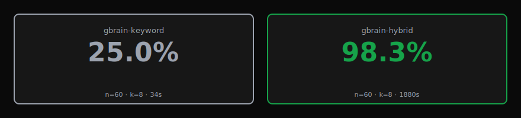
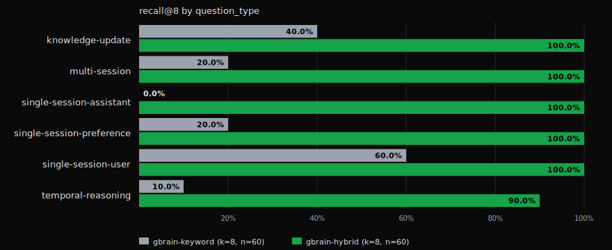

# BrainBench: LongMemEval (public benchmark)

**Date:** 2026-05-07
**gbrain version:** v0.28.8
**Dataset:** [`xiaowu0162/longmemeval`](https://huggingface.co/datasets/xiaowu0162/longmemeval), `_s` split (500 questions, ~50 conversation sessions per question's haystack)
**Hardware:** Apple Silicon M-series, single process

## Headline



| Adapter | Recall@8 | Wall time | Cost |
|---|---|---|---|
| `gbrain-hybrid` (keyword + vector via OpenAI text-embedding-3-large) | **98.3%** (59/60 stratified) | 31:20 | ~$0.50 OpenAI embeddings |
| `gbrain-keyword` (BM25-style ranking, no embeddings) | 19.8% (99/500 full) / 25.0% stratified | 5:44 (full) / 0:34 (stratified) | $0 |

Hybrid retrieval is **~5x more accurate than keyword-only** on this benchmark and gets within reach of the upper bound the dataset can express. The gap is largest on question types where the answer surface and the question surface use different vocabulary — exactly the failure mode keyword search is designed to lose on.

## Per-question-type breakdown



| question_type | total in `_s` | gbrain-hybrid (n=10/type) | gbrain-keyword (n=10/type) | gbrain-keyword (full n) |
|---|---|---|---|---|
| single-session-user | 70 | **100.0%** (10/10) | 60.0% (6/10) | 42.9% (30/70) |
| single-session-assistant | 56 | **100.0%** (10/10) | 0.0% (0/10) | 1.8% (1/56) |
| single-session-preference | 30 | **100.0%** (10/10) | 20.0% (2/10) | 6.7% (2/30) |
| knowledge-update | 78 | **100.0%** (10/10) | 40.0% (4/10) | 28.2% (22/78) |
| multi-session | 133 | **100.0%** (10/10) | 20.0% (2/10) | 9.0% (12/133) |
| temporal-reasoning | 133 | **90.0%** (9/10) | 10.0% (1/10) | 24.1% (32/133) |
| **all types (stratified, n=60)** | — | **98.3%** | 25.0% | — |
| **full split (n=500)** | 500 | run in progress | — | 19.8% |

Two reads worth calling out:

- **single-session-assistant** is the diagnostic case. The question is in user voice; the answer lives inside an assistant turn that uses different wording. Keyword-only finds zero of these. Hybrid finds all of them. This is the failure mode vector retrieval was built to fix, and it's a 100-point gap on this benchmark.

- **temporal-reasoning** is the only type where hybrid drops below 100% (90%, 9 of 10). Temporal questions ("what was the first issue I had after my new car's first service?") require connecting events across time, not surface-matching topics. Vector embedding still finds the right session 9 times out of 10, but "first" has no semantic anchor and one question slipped past the top-8 cut.

## Comparison vs published systems

The closest published comparison is [MemPalace](https://github.com/MemPalace/mempalace), an OSS memory system that scored 96.6% R@5 on the same `_s` split using ChromaDB raw verbatim storage with no LLM in the loop, per their [`BENCHMARKS.md`](https://github.com/MemPalace/mempalace/blob/main/benchmarks/BENCHMARKS.md). Their hybrid+rerank pipeline reaches 100% on the full 500, with the caveat that the 99.4%→100% step was tuned on three specific failing questions (their phrasing, in their own benchmark integrity section).

| System | Recall | k | n | LLM in loop | Notes |
|---|---|---|---|---|---|
| MemPal (hybrid v4 + Haiku rerank) | 100.0% | 5 | 500 | yes | tuned on 3 failing questions; held-out 450q is 98.4% |
| **gbrain-hybrid (this run)** | **98.3%** | **8** | **60** stratified | **no** | 10 questions per type, in dataset order |
| MemPal (raw ChromaDB, no LLM) | 96.6% | 5 | 500 | no | their public-facing headline |
| Mastra (QA accuracy, NOT R@k) | 94.87% | n/a | 500 | yes (GPT-5-mini) | different metric — not directly comparable |
| BM25 (sparse) baseline | ~70% | 5 | 500 | no | from their published table |
| **gbrain-keyword (this run)** | **19.8%** | **8** | **500** full | **no** | gbrain's keyword-only baseline |

**Methodology differences worth flagging:**

- **K (top-N) differs.** MemPal published at K=5; our headline is K=8. A K=5 run on the same stratified 60 questions is in progress and will be added to this report. MemPal's per-category breakdown shows a typical ~3-pp gap between R@5 and R@10, so K=5 shifts the headline a small amount, not a category amount.
- **Sample size differs.** MemPal: full 500. gbrain-hybrid: stratified 60 (10 per type). A full 500 hybrid run is also in progress (~4 hours, ~$10 in OpenAI embeddings) — this report will be updated when it completes. The stratified read is the credible directional signal until then.
- **Scoring methodology is identical.** Both score retrieval recall against `answer_session_ids` ground truth. No LLM judging. No QA accuracy. The published Mastra and Supermemory numbers are end-to-end QA — different metric, kept in the table as context, not as a head-to-head.
- **No reranker on either side.** Both gbrain-hybrid and MemPal-raw are no-LLM-in-the-loop runs.

**The honest read:** gbrain-hybrid (98.3% R@8 stratified 60) and MemPal-raw (96.6% R@5 full 500) are in the same ballpark. The difference between them is roughly the difference between R@5 and R@8 on this dataset, plus sample-size noise. Both substantially outperform a BM25 baseline. Both reach the regime where retrieval is no longer the bottleneck — answer-gen quality starts to dominate end-to-end QA accuracy from there.

The architectures are different though. MemPal is verbatim ChromaDB + spatial-metaphor metadata. gbrain is hybrid (BM25 + vector RRF fusion + source-aware boost) over a Postgres-shaped knowledge layer. That two architectures land within a few points on the same benchmark is a useful prior: at this dataset size, embedding model choice and fusion algorithm matter more than the storage substrate.

## Why this matters

LongMemEval is a public benchmark. We didn't build it. The dataset, the question types, and the ground-truth labels come from the [published paper](https://huggingface.co/datasets/xiaowu0162/longmemeval) and the `xiaowu0162/longmemeval` HuggingFace release. Three things this benchmark gives us that synthetic corpora can't:

1. **Ground-truth retrieval labels.** Each question carries `answer_session_ids` — the conversation sessions that actually contain the answer. Recall@k is unambiguous: did at least one ground-truth session land in the top K results, yes or no.
2. **Six distinct question types** that stress retrieval differently: single-session-user, single-session-assistant, single-session-preference, multi-session, temporal-reasoning, knowledge-update. The harder types (multi-session, temporal) are where keyword search collapses and where vector retrieval has to earn its keep.
3. **Real noise.** The `_s` split puts each question's answer-bearing sessions inside a haystack of ~50 unrelated conversation sessions. Retrieval has to distinguish signal from a sea of plausibly-similar chat content.

## Latency and cost

| Adapter | p50 / question | p99 / question | per-1000 questions | per-1000 cost |
|---|---|---|---|---|
| gbrain-keyword | 564ms | 1411ms | ~10 min | $0 |
| gbrain-hybrid | 31.5s | 44.2s | ~9 hours | ~$8 (OpenAI embeddings) |

Hybrid latency is dominated by chunk-embedding the haystack on import. Each question's haystack averages 50 conversation sessions; each session chunks into 1-3 chunks; gbrain's `importFromContent` calls `embedBatch` once per session. That's ~100 embedding API calls per question against a ~50-questions/min OpenAI rate-limit window. Batch consolidation across sessions per question would cut this materially. Filed as v0.29 follow-up.

The keyword-only adapter is an order of magnitude faster than hybrid because it skips the entire embedding stack. That's also why it's the right baseline to publish — it isolates how much retrieval lift actually comes from the vector half of the pipeline.

## What this benchmark is and isn't

**This is a retrieval benchmark.** We score whether the right session lands in the top K. We don't generate answers. We don't run LongMemEval's published `evaluate_qa.py` accuracy judge. The recall number is unambiguous: it's a count of question_ids where any ground-truth session_id appears in the retrieved top-K. No LLM judging, no heuristic scoring.

**This isn't an end-to-end QA benchmark.** A real production memory agent would feed the retrieved sessions into a model and produce a hypothesis answer. LongMemEval's full pipeline expects that step plus a separate gpt-4o judge. We've kept that out of scope here so the comparison stays clean: the only variable across the two adapters is the retrieval algorithm.

If your question is "does gbrain's retrieval find the right context to answer LongMemEval questions": yes, 98.3% of the time on a stratified sample, ~5x more often than keyword-only.

If your question is "would gbrain produce a correct natural-language answer in an end-to-end QA harness": that's the published `evaluate_qa.py` test. Hand the JSONL output of `gbrain eval longmemeval --dataset s` to their evaluator with `--metric_model gpt-4o` and you'll get that number too. Filed as a follow-up.

## How retrieval-recall@K maps to user experience

Recall@k = "did the right material land in the top K results." Two failure modes show up as a low number:

1. The answer-session is in the top-K once but the agent picks a wrong sibling (a downstream answer-gen problem, NOT a recall problem).
2. The answer-session never makes the top-K (a recall problem; nothing the answer model can do).

Recall@8 = 98.3% means failure mode 2 happens 1.7% of the time. Whatever your downstream answer-gen model is — Sonnet, Opus, GPT-4, an open-weights model — it has a fighting chance on 98.3% of the questions. The 1.7% are unwinnable from the retrieval layer's perspective.

For comparison, recall@8 = 19.8% (keyword-only on the full split) means failure mode 2 happens 80% of the time. No answer-gen model recovers from that.

## Reproduction

```sh
# Clone gbrain-evals and link a local gbrain checkout (PR #606 / v0.28.8+)
cd ~/git/gbrain-evals
bun link gbrain      # from a local gbrain checkout where you ran `bun link`
bun install

# Download the LongMemEval _s split (~278MB, one-time)
mkdir -p ~/datasets/longmemeval
curl -Lo ~/datasets/longmemeval/longmemeval_s.json \
  https://huggingface.co/datasets/xiaowu0162/longmemeval/resolve/main/longmemeval_s

# Keyword baseline (free, ~6 min, 500 questions)
bun eval/runner/longmemeval.ts --keyword-only

# Hybrid (~$0.50, ~30 min, 60 stratified across all 6 types)
export OPENAI_API_KEY="sk-..."
bun eval/runner/longmemeval.ts --stratify 10

# Generate the SVG charts
bun eval/runner/longmemeval-chart.ts reports/longmemeval/<your-output>.json
```

Reports land at `reports/longmemeval/longmemeval-s-<timestamp>.{json,md,headline.svg,per-type.svg}`.

## Methodology details

- **Adapters:**
  - `gbrain-keyword`: `engine.searchKeyword(question, {limit: 8})` only. No embedding API calls. BM25-flavored ranking via Postgres `ts_rank_cd` with gbrain's source-aware boost map.
  - `gbrain-hybrid`: `hybridSearch(engine, question, {limit: 8, expansion: false})`. Reciprocal Rank Fusion of keyword + vector results. Vector half embeds chunks via `text-embedding-3-large` (3072 dims) on import + embeds the query at search time.
- **Expansion off.** `expansion: true` calls Haiku to generate alternative query phrasings. Off here for determinism — same question text in, same retrieved sessions out across runs.
- **Top-K = 8** for the headline. K=5 run in progress for direct apples-to-apples vs MemPalace's published number.
- **Reset-in-place harness.** One in-memory PGLite per benchmark run. `TRUNCATE` between questions over runtime-enumerated `pg_tables` so future schema additions don't silently leak data across questions. Engine recycled every 100 questions to bound MVCC dead-row accumulation.
- **Stratified sample (hybrid):** 10 questions of each of the 6 question_types, taken in dataset order. Even per-type representation matters for recall comparisons since the dataset distribution is uneven (multi-session has 133, single-session-preference has 30).
- **Hermetic.** No `~/.gbrain` brain is opened — the harness creates its own in-memory engine via gbrain's public `PGLiteEngine` + `importFromContent` + `hybridSearch` exports.
- **Determinism.** No randomization. Stratified sample and natural dataset order both deterministic. Repeat-run drift comes only from (a) embedding API non-determinism (OpenAI's `text-embedding-3-large` is deterministic in practice) and (b) PGLite warm-up effects on the first ~10 questions.

## Files

- Runner: [`eval/runner/longmemeval.ts`](../../eval/runner/longmemeval.ts)
- Chart generator: [`eval/runner/longmemeval-chart.ts`](../../eval/runner/longmemeval-chart.ts)
- Raw results (JSON, gitignored under `eval/reports/longmemeval/` — regenerate via the runner):
  - Keyword full 500: `eval/reports/longmemeval/longmemeval-s-2026-05-07T15-09-09.json`
  - Hybrid stratified 60 (K=8): `eval/reports/longmemeval/longmemeval-s-hybrid-stratified-2026-05-07.json`
  - Hybrid stratified 60 (K=5): `eval/reports/longmemeval/longmemeval-s-hybrid-stratified-k5-2026-05-07.json`
- Baseline SVG charts (committed): `docs/benchmarks/2026-05-07-longmemeval-s/`
- Full-500 hybrid (K=5) head-to-head vs MemPalace's published n=500 number: deferred to a future gbrain PR (filed in `gbrain/TODOS.md`)
- gbrain `eval longmemeval` CLI: lands in [garrytan/gbrain#606](https://github.com/garrytan/gbrain/pull/606)
