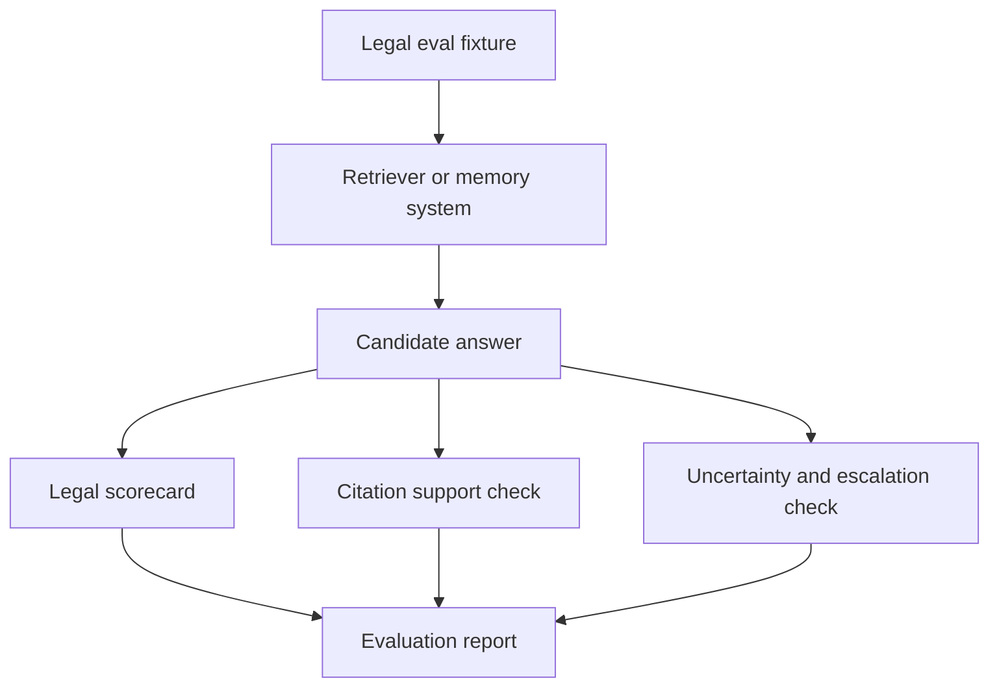

# Launch Readiness

This document explains how to evaluate the legal RAG adaptation in this fork.

## What this repo proves

This fork adds a legal AI evaluation layer for retrieval, citation accuracy, legal completeness, uncertainty handling and escalation quality. It is designed to test whether a legal memory or RAG system can answer with sources, acknowledge gaps and escalate when the answer should not be automated.

The core proof is evaluation discipline: fixtures, scorecards, failure taxonomy and quality dimensions for legal workflows.

## Architecture



## Local launch path

Install dependencies:

```bash
bun install
```

Run upstream benchmark slices as documented in the repository README. For legal RAG work, start with:

```bash
cd legal-rag-evals
```

Then inspect the fixtures, scorecard and taxonomy before wiring them into a runner.

## Demo path

1. Open `LEGAL_RAG_EVALS.md`.
2. Open `legal-rag-evals/README.md`.
3. Inspect MiCAR white paper review fixtures.
4. Inspect the 10-point legal answer scorecard.
5. Inspect the failure taxonomy.
6. Explain how each dimension maps to regulated legal AI: retrieval, citation, legal completeness, uncertainty, escalation and confidentiality.
7. Run or adapt the nearest available benchmark runner once the eval target is selected.

## Checks

```bash
bun install
bun test
bun run typecheck
```

If upstream benchmark scripts require API keys, use small samples first. Do not run large benchmark jobs until cost and dataset location are understood.

## Sample data rule

Use synthetic legal fixtures and public legal texts. Do not use privileged client facts, confidential matter documents, unpublished legal advice or production company memory in public eval runs.

## Safety posture

This repo evaluates legal AI systems. It does not provide legal advice. Any benchmark result should be treated as a quality signal, not a certification of legal correctness or regulatory fitness.

## Good evaluator route

A reviewer should inspect the fork note in the root README, `LEGAL_RAG_EVALS.md`, `legal-rag-evals/README.md`, the fixtures, the scorecard and the failure taxonomy. The key signal is that legal AI quality is assessed through evidence, citations, missing-information handling and escalation rather than generic helpfulness.